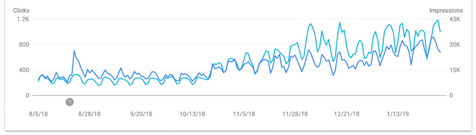

### Gatsby  SEO 최적화 시리즈 😉  
> [Gatsby 블로그에 Google Analytics 플러그인 추가하는 법](https://janeljs.github.io/blog/google-analytics/)    
[Google Search Console에 Gatsby 블로그 등록하는 법](https://janeljs.github.io/blog/google-search-console/)   
[Gatsby 블로그에 RSS 추가하는 법](https://janeljs.github.io/blog/rss/)     
[Gatsby 블로그에 advanced-sitemap 플러그인 추가하는 법](https://janeljs.github.io/blog/gatsby-advanced/)    

## plugin을 설치하게 된 배경
- SEO 최적화 시리즈 2단계에서 이미 sitemap.xml을 제출했고, rss도 제출을 했지만 내 블로그는 좀처럼 구글에 검색되지 않는다.
- 아직 블로그를 개설한지 얼마 안 되어 그런 것도 있겠지만, 일전에 티스토리 블로그와 네이버 블로그를 운영할 때는 개설한지 얼마 안 된 시점에서도 쉽게 상위 노출이 되었었다. 
- 열심히 포스팅을 하는 것에 비해 성과가 좋지 않아 Gatsby SEO에 대해 검색하던 중 다음의 기사를 발견했다.  
	[Advanced Sitemap Plugin for SEO](https://www.gatsbyjs.com/blog/2019-05-07-advanced-sitemap-plugin-for-seo)

	> Rebuilding our docs site using Gatsby was a huge success. We saw **major improvements to our SEO performance** within two weeks of launching, and watched as our rankings improved and organic search visibility increased drastically over the following months.
	...
	This success can be attributed to having improved content and meta data, a lightning-fast website powered by Gatsby and Ghost, and from **submitting our new advanced sitemap** to the search engines. 

	

- 기사에서 추정하는 SEO 성과 향상의 핵심 요인은 다음과 같다.  
	- 질적으로 개선된 컨텐츠와 meta 데이터
	- Gatsby와 Ghost로 작동하는 빠른 웹사이트 
	- <span style="color:purple">**✨새로운 advanced sitemap 제출✨**</span>
- 이런 이유로 결과가 어떨지는 모르겠지만 나도 희망을 가지고 플러그인을 설치해보기로 했다. 
- 이번에도 노출이 안 되면 네이버랑 Bing에도 등록하려고 한다... 제발 되기를🙏

## 따라해보자! Follow me 😎

1. git bash에 npm 명령어 실행
```bash
npm install --save gatsby-plugin-advanced-sitemap
```

2. `gatsby-config.js`에 아래 코드 추가 
```bash
siteMetadata: {
    siteUrl: `https://www.example.com`,
},
plugins: [
    `gatsby-plugin-advanced-sitemap`
]
```
3. 빌드 한 뒤 sitemap이 잘 형성되었는지 확인하기 
```bash
gatsby build && gatsby serve
```
4. 완료한 뒤 `https://본인의 깃허브 주소/sitemap-pages.xml`로 접속하면 자신의 Advanced Sitemap을 확인할 수 있다.


#

***Source***

- [gatsby official site](https://www.gatsbyjs.com/plugins/gatsby-plugin-advanced-sitemap/)  
- [Advanced Sitemap Plugin for SEO](https://www.gatsbyjs.com/blog/2019-05-07-advanced-sitemap-plugin-for-seo)