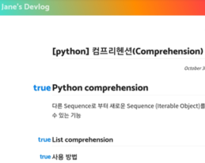

> 기록을 남기는 목적: 개츠비 블로그를 배포하면서 수많은 에러를 마주했는데 이번에 고약하고 아직까지도 완전히 파악하지 못한 에러가 발생하여 기록을 남겨둔다.

## 에러 종류

- 모든 heading 앞에 true가 출력 

 

## 발생 이유

- master branch에서 `gatsby build` 대신 `gatsby develop`으로 sitemap.xml과 rss.xml 생성 
	- gatsby 공식 문서를 보면 "The gatsby develop command doesn’t perform some of the production build steps that the gatsby build command does"라고 나와있다. 
	- gatsby develop만으로도 sitemap과 rss 파일이 잘 형성되었어서 별 생각 안 하고 넘어갔는데 gatsby build가 수행하는 몇 단계를 건너뛰어서 해당 오류가 발생한 것 같다. 
	- 평소에는 github action으로 배포 자동화를 시켜놓아 `gatsby build` 명령어를 사용할 일이 없었는데 앞으로 master branch에서 빌드할 때는 유의해야겠다.

## 해결 방법

- master branch에서 **`gatsby build`** 명령어를 실행하니 true가 없어졌다. 

## 의문점 
- `npm run start`를 사용해서 localhost:8000을 열 때는 true가 생기지 않는데 `gatsby develop`을 사용해서 개발 서버를 열었을 때 왜 해당 문제가 생겼는지는 모르겠다. 구글링을 해봐도 나같은 증상을 겪는 사람이 없는 것 같았다. 

- (혹시 몰라 남겨두는) 에러가 발생하기 전에 한 행동
	1. gatsby gtag 플러그인 설치 및 gatsby-config.js 파일에 코드 추가
	2. GA에서 추적이 안 되길래 gtag를 삭제한 뒤, google analytics 플러그인 설치 후 gatsby-config.js 파일에 코드 추가

#

***Source***
[gatsby official site/gatsby build(https://www.gatsbyjs.com/docs/overview-of-the-gatsby-build-process/)