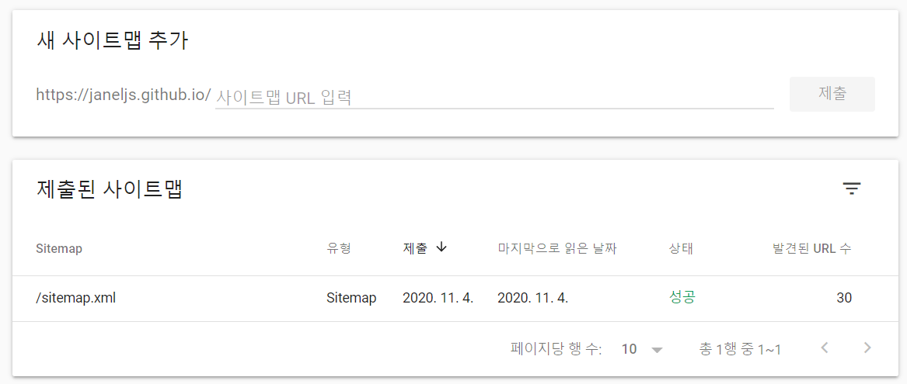
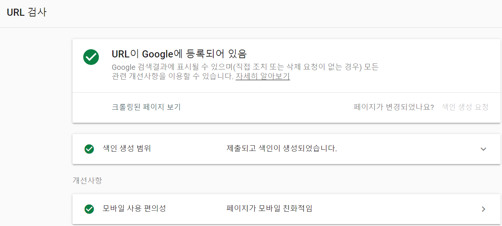

### Gatsby  SEO 최적화 시리즈 😉  
> [Gatsby 블로그에 Google Analytics 플러그인 추가하는 법](https://janeljs.github.io/blog/google-analytics/)  
[Gatsby 블로그에 RSS 추가하는 법](https://janeljs.github.io/blog/rss/)

## 따라해보자! Follow me 😎
1. [google search console](https://search.google.com/search-console/about) 사이트 접속 

2. 속성 추가 > URL 접두어 > 메타 태그 인증 클릭 
	- gatsby blog를 master와 develop 브랜치로 나눠서 관리하고 있다면 master branch의 **`index.html`** 파일의 **`head`** 영역에 메타 태그를 삽입해주면 된다. 

3. sitemap 등록
	- **`gatsby-plugin-sitemap`** 플러그인을 통해 sitemap.xml 파일을 master branch에 생성할 수 있다. 
	- 아래 `사이트맵 URL 입력` 란에 **`sitemap.xml`**이라고 입력해준 뒤 제출

4. 마지막으로 `URL 검사`를 클릭해서 내 깃허브 블로그 주소가 잘 등록되어 있는지 확인하면 완료! 

#
