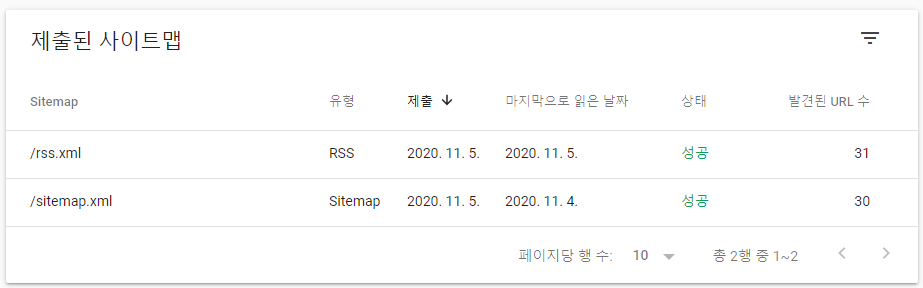

### Gatsby  SEO 최적화 시리즈 😉  
> [Gatsby 블로그에 Google Analytics 플러그인 추가하는 법](https://janeljs.github.io/blog/google-analytics/)    
[Google Search Console에 Gatsby 블로그 등록하는 법](https://janeljs.github.io/blog/google-search-console/)   
[Gatsby 블로그에 RSS 추가하는 법](https://janeljs.github.io/blog/rss/)     
[Gatsby 블로그에 advanced-sitemap 플러그인 추가하는 법](https://janeljs.github.io/blog/gatsby-advanced/)    


## 따라해보자! Follow me 😎

1. git bash에 npm 명령어 입력 
```bash
npm install gatsby-plugin-feed
```


2. gatsby-config.js에 아래 코드 추가 

	```bash
	module.exports = {
	  siteMetadata: {
	    siteUrl: `https://www.example.com`,
	  },
	  plugins: [`gatsby-plugin-feed`],
	}
	```

3. gatsby-node.js에 아래 코드 추가

	```bash
	const { createFilePath } = require(`gatsby-source-filesystem`)
	exports.onCreateNode = ({ node, actions, getNode }) => {
	  const { createNodeField } = actions
	  if (node.internal.type === `MarkdownRemark`) {
	    const value = createFilePath({ node, getNode })
	    createNodeField({
	      name: `slug`,
	      node,
	      value,
	    })
	  }
	}
	```

4. `npm run build`로 빌드하기
5. 구글 서치 콘솔에 RSS 제출하기 


	- 만약 RSS를 제출했는데 `가져올 수 없음`이 뜬다면 `URL 검사`에 내 RSS 주소를 입력하여 색인을 생성한 뒤 다시 제출하면 된다.  
	- URL 검사 시 `URL이 Google에 등록되어 있지 않음`이 뜬다면 `실제 URL 테스트`를 눌러 내 RSS url을 등록할 수 있다. 
	- 다시 `Sitemaps`로 들어가 `새 사이트맵 추가`에 rss.xml을 추가해주면 된다. 


#

***Source***

[Adding an RSS Feed gatsby official site](https://www.gatsbyjs.com/docs/adding-an-rss-feed/)  
