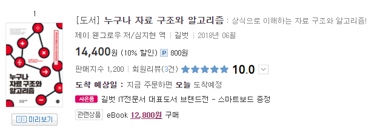
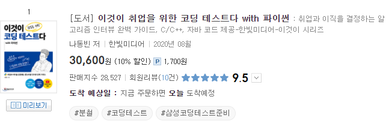

## 📕 누구나 자료구조와 알고리즘

  
  - 📖 어렵게만 느껴졌던 자료구조의 기본기를 다지는데 도움이 되었던 책
  -   ***Data Structures and Algorithms in Java 6***로 처음 자료구조 공부를 시작했었는데, 설명도 매우 자세하고 정말 좋은 책이지만 영어로 되어있는데다가 분량이 매우 방대하여 하루에 한 챕터룰 공부하는 것이 한계였다.   
그러던 중 **`누구나 자료구조와 알고리즘`**을 발견하였고, 2일 정도만에 거의 다 읽었다. 책을 다 읽고 다시 원서를 읽으니 한결 수월하다. 아직 나도 갈 길이 멀지만 처음 자료구조를 공부하는 사람이 있다면 이 책을 선물로 주고 싶다.

## 📘 이것이 취업을 위한 코딩 테스트다 with 파이썬 

 

#

