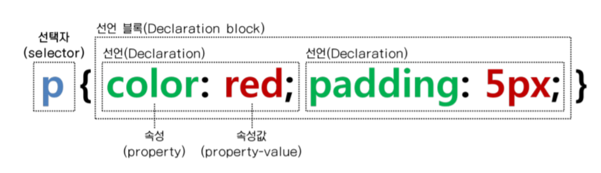

# CSS

- Cascading Style Sheets
- HTML 문서를 시각적으로 예쁘게 꾸며준다.
- Cascading(위에서부터 우선순위)
  - Author style
  - User style
  - Browser
- !important
  - cascading을 끊어내고 가장 우선순위가 된다.

## CSS 우선순위

1. !important
   - 되도록 안 쓰는게 좋다.
2. Inline 스타일
   - div 안에 바로 style 넣은 것
3. ID로 지정
   ```css
   #special {
     color: skyblue;
   }
   ```
4. class로 지정
   - .클래스 이름 {속성값}
5. 태그로 지정
6. 전체 지정

💡 특징적이고 구체적인 것일수록 우선순위가 높다.

## 사용 방법

- inline
  - 직접 쓰기
  ```html
  <div style="..."></div>
  ```
- internal

  - `<head>`에 선언

  ```html
  <head>
    <style type="text/css">
      ...;
    </style>
  </head>
  ```

- external
  - 외부에서 css 파일을 가져와 적용하기 (가장 많이 쓰는 방법)
    ```html
    <link rel="stylesheet" type="text/css" href="main.css" />
    ```
    - rel: 현재 파일과 link되는 파일 사이의 관계를 명시
    - type: 연결되는 파일 타입 명시
    - href: 연결되는 파일 URL 제공

## CSS 기본 형태

- Tag 선택자
- Class 선택자
- Id 선택자

### 선택자 구성 요소



- 선택자(selector): 어떤 HTML 요소에 스타일을 입힐 것인지를 선택
  - e.g. h1
- 속성(attribute): 무엇을
  - e.g. color
- 속성값(value): 어떻게 바꿀까?
  - e.g. red

### Id vs Class

- id
  - 한 페이지에서 유일
  - 태그 당 한 개의 id만 가진다.
  - 문서 구조를 나눌 때 사용한다.
    e.g. `<div id = "header">`
  - class로 적용된 스타일을 덮어씌울 때 사용한다.
  - 남용하면 좋지 않다.
- class

  - 한 페이지에서 반복해서 사용할 수 있다.
  - 한 태그에 여러개 class를 적용할 수 있다.
  - 재활용할 수 있는 스타일을 지정할 때 사용한다.

  ```html
  .header { color: #ffffff; }
  ```

### 선택자 사용 방법

- Universal \*
- type Tag
- ID #id
- Class .class
- State :
- Attribute []
  ```css
  /* naver로 시작하는 요소들만 초록색 지정 */
  a[href^='naver'] {
    color: green;
  }
  /* .com으로 끝나는 요소들만 보라색 지정 */
  a[href$='.com'] {
    color: purple;
  }
  ```

* 선택자는 중첩하여 사용할 수 있다.

```css
li#special {
  color: pink;
}
```

## CSS 속성

- color : 글씨 색상
- font-size: 폰트 크기
  - em: parent element의 크기가 20px이라면
    - 1em = 20px
    - 0.5em = 10px
- font-family : 글씨체
  ```html
  h1 { font-family: Georgia, serif; }
  ```
- width : 너비
- height : 높이
- margin : 여백 (바깥) = 요소 바깥 여백
  - margin top, right, bottom, left 시계방향 or 위아래/양옆으로 한 번에 지정 가능
- padding : 여백 (안쪽) = 요소 안쪽 여백
  - padding top, right, bottom, left 시계방향 or 위아래/양옆으로 한 번에 지정 가능
- background-image : 배경
  ```css
  .hero {
    background-image: url('https://content.codecademy.com/projects/make-a-website/lesson-2/bg.jpg');
    background-size: cover;
  }
  ```
- border : 테두리 두께
  - width, style, color 한 번에 작성 가능
  ```css
  border: 2px solid #ffffff;
  ```

#

**_Source_**

- 스튜디오 마르 css 세션
- [codeacademy](https://www.codecademy.com/learn/make-a-website)
- [드림코딩 by 엘리](https://www.youtube.com/watch?v=gGebK7lWnCk&feature=emb_logo)

**_CSS 공부하기 좋은 사이트_**

- [CSS Dinner selector 연습](https://flukeout.github.io)
- [MDN CSS Selectors](https://developer.mozilla.org/en-US/docs/Glossary/CSS_Selector)
- [CSS Reference](https://developer.mozilla.org/en-US/docs/Web/CSS/Reference)
- [CSS Properties Reference](https://developer.mozilla.org/en-US/docs/Web/CSS/CSS_Properties_Reference)
