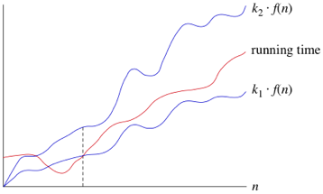

## 복잡도
- 알고리즘의 성능을 나타내는 척도
	- 시간복잡도: 특정한 크기의 입력에 대하여 알고리즘이 얼마나 오래 걸리는지 
	- 공간복잡도: 특정한 크기의 입력에 대하여 알고리즘이 얼마나 많은 메모리를 차지하는지
- 동일한 기능을 수행한다면 복잡도가 낮을 수록 좋은 알고리즘이다.
- 복잡도의 측정을 통해 얻을 수 있는 것
	- 시간복잡도: 알고리즘을 위해 필요한 연산의 횟수
	- 공간복잡도: 알고리즘을 위해 필요한 메모리의 양 
- 시간복잡도와 공간복잡도는 Trade-off가 성립
	- e.g. Memoization: 메모리를 많이 사용해서 시간을 비약적으로 단축하는 기법 


## 시간 복잡도(Time complextiy)

- 시간복잡도 = 효율성 = 성능
- 각 연산이 수행되는데 몇 단계가 필요한지 측정
- ***Tip!*** steps라는 변수를 추가하여 단계수를 기록하면 시간복잡도 증명 가능


## O (Big-O)
- 시간의 상한 (upper bound)
- $f(n) = O(g(n))$   
	&rarr; $f(n)$의 상한은 $g(n)$   
	&rarr; $f(n)$의 growth rate<= $g(n)$의 growth rate


<br/>

$O(n)$

- 선형 시간(linear time)

```python
def is_prome(number):
	for i in range(2, number):
		if number % i == 0:
			return False
	return True
```

```jsx
function hasDuplicateValue(array) {
    var existingNumbers = [];
    for(var i = 0; i < array.length; i++) {
        if(existingNumbers[array[i]] === undefined) {
            existingNumbers[array[i]] = 1;
        } else {
            return true;
        }
    }
    return false;
}
```

<br/>

$O(1)$

- 상수 시간(constant time)


<br/>

$O(log n)$

- 로그 시간(log time)
- 데이터가 두 배로 증가할 때마다 한 단계씩 늘어나는 알고리즘
    - logarithm = log
        - 지수와 역의 관계


<br/>

$O(n^2)$

- 이차 시간(quadratic time)

$O(n^3)$
- 삼차 시간 (코딩테스트에서는 피하는 것이 좋음)


## Ω (Big-Omega)
- 시간의 하한 (lower bound)

## θ (Big-Theta)
- 점근적으로 근접한 한계값 
- $f(n)$ = $θ(g(n))$   
&rarr; $n$이 충분히 크다면 실행 시간이 어떤 상수 k1과 k2에 대하여 최소 $k1*g(n)$이며 최대 $k2*g(n)$이 된다는 뜻 

<br/>




<br/>

### 연습문제

- if $f(n) = O(g(n))$ and $f(n) = Ω(g(n))$, then we have $(f(n))^2 = Θ(g(n)^2)$ `true`
- if $f(n) = O(g(n))$ and $f(n) = Ω(g(n))$, then we have $f(n) = g(n)$ `false`
- 3498103948 = `Θ(1)`
- log2^n = nlog2 = `Θ(n)`
- 4n^3 + 2n^log n = `Θ(n^log n)`
- log2^(3n^4 - 5n^2 + 4) = `Θ(n^4)`
- T(n) = 2 * T(n-1), T(0) = 1 `T(n) = Θ(2^n)`
- factorial 메소드의 시간복잡도를 구하여라

	```java
	int factorial(int n) {
		if (n ==1)
			return 1;
		else
			return n * factorial(n-1)
	}
	```

	T(n) = O(1) + (n-1) * O(1) = `O(n)`


<br/>

🍯 ***Tip!***

$log n < n < n log n < n^2 < 2^n < 100^n < n! < n^n$

다항함수 < 지수함수 < 팩토리얼 < $n^n$

🍯 ***Tip!***
- 시간 제한이 1초일 때
	- N의 범위가 500인 경우: $O(n^3)$
	- N의 범위가 2,000인 경우: $O(n^2)$
	- N의 범위가 100,000인 경우: $O(nlogn)$
	- N의 범위가 10,000,000인 경우: $O(n)$

## 공간 복잡도(Time complextiy)
- 시간 복잡도와 마찬가지로 빅오 표기법 사용 

## 시간과 메모리 측정


#

***Source***
- A Common-Sense Guide to Data Structures and Algorithms
- [khanacademy](https://ko.khanacademy.org/computing/computer-science/algorithms/asymptotic-notation/a/big-big-theta-notation)
- Data Structures and Algorithms in Java
- 이것이 취업을 위한 코딩테스트다 with 파이썬 