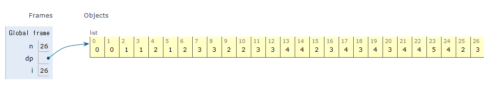

## 다이나믹 프로그래밍(Dynamic Programming)

- 연속적이지 않은 데이터에 대해 메모이제이션 기법을 사용하는 경우 배열이나 리스트가 아닌 사전(dict) 자료형을 이용하는 게 더 효과적이다.
- 완전 탐색으로 접근했을 때 시간 초과가 뜬다면 다이나믹 프로그래밍으로 해결할 수 있는지 부분 문제들의 중복 여부를 확인해보는 것이 좋다.
- 재귀함수를 이용한 탑다운 방식보다는 보텀업 방식으로 구현하는 것이 좋지만, 재귀함수로 구현했다면 sys 라이브러리의 setrecursionlimit() 메서드를 이용해 재귀 제한을 완화할 수 있다.

```py
>>> import sys
>>> sys.getrecursionlimit()
1000
>>> sys.setrecursionlimit(2000)    # 최대 재귀호출 횟수를 2000으로 늘림
```

## 실전 문제1: 1로 만들기

## Testcase

```py
26
# 3
```

## Solution

- 쉬운 문제인데 혼자 힘으로 못 풀었다. 언제쯤 혼자 힘으로 DP 문제를 풀 수 있을까?
- 2시간 동안 고민하다가 풀이를 봤는데 잘 이해가 안 되어 python tutor를 보고 겨우 이해했다.
  

```py
n = int(input())

dp = [0] * 30001

for i in range(2, n + 1):
    dp[i] = dp[i - 1] + 1

    if i % 2 == 0:
        dp[i] = min(dp[i], dp[i // 2] + 1)
    if i % 3 == 0:
        dp[i] = min(dp[i], dp[i // 3] + 1)
    if i % 5 == 0:
        dp[i] = min(dp[i], dp[i // 5] + 1)

print(dp[n])

```

#

**_Source_**

- https://github.com/ndb796/python-for-coding-test
- https://dojang.io/mod/page/view.php?id=2358
