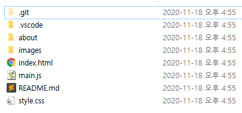

> 우분투 듀얼 부팅을 설치한 뒤 windows와 ubuntu를 번갈아가며 쓰다보니 원격저장소 내용을 pull해오고 다시 push하는 식으로 작업해야 했다. pull과 push를 위해서는 일단 원격 저장소를 내 로컬 저장소에 복사해와야 하는데 이 때 사용되는 명령어가 git clone이다. 

## 따라해보자! Follow me 😎

1. 원격 저장소를 다운받고 싶은 폴더로 이동한다.
```bash
$ cd [디렉토리 이름]
```

2. `git clone` 명령어를 실행한다. 
```bash
$ git clone [clone하고자 하는 repository URL]
```
- 만약 디렉토리 이름을 지정하고 싶다면 아래와 같이 실행하면 된다.
	```bash
	$ git clone [clone하고자 하는 repository URL] [지정하고 싶은 디렉토리 이름]
	```

3. 폴더에 들어가보면 성공적으로 clone된 것을 확인할 수 있다.


<br/>

### 💡참고 
git clone 명령어를 실행하면 내부적으로는 아래와 같은 일이 일어난다. 
1. 새로운 디렉토리를 만든 후 해당 디렉토리로 들어간다. 

	```bash
	$ mkdir [디렉토리 이름]
	$ cd [생성한 디렉토리 이름]
	```

2. `git init` 명령으로 빈 Git 저장소를 생성한다. 

	```bash
	$ git init
	Initialized empty Git repository in C:/Users/jisun/about/.git/
	```

3. 입력한 URL을 원격 저장소에 추가하고 git fetch 명령으로 원격 저장소의 데이터를 가져온다. 
	```bash
	$ git remote add origin(단축이름) [URL]
	$ git fetch origin(단축이름)
	```
4. 최종 커밋을 워킹 디렉토리에 checkout한다. 

#

***Source***
- [Appendix C: Git 명령어 - 프로젝트 가져오기와 생성하기](https://git-scm.herokuapp.com/book/ko/v2/Appendix-C%3A-Git-%EB%AA%85%EB%A0%B9%EC%96%B4-%ED%94%84%EB%A1%9C%EC%A0%9D%ED%8A%B8-%EA%B0%80%EC%A0%B8%EC%98%A4%EA%B8%B0%EC%99%80-%EC%83%9D%EC%84%B1%ED%95%98%EA%B8%B0)
- [Git의 기초 - Git 저장소 만들기](https://git-scm.herokuapp.com/book/ko/v2/Git%EC%9D%98-%EA%B8%B0%EC%B4%88-Git-%EC%A0%80%EC%9E%A5%EC%86%8C-%EB%A7%8C%EB%93%A4%EA%B8%B0#_git_cloning)
- [Git의 기초 - 리모트 저장소](https://git-scm.com/book/ko/v2/Git%EC%9D%98-%EA%B8%B0%EC%B4%88-%EB%A6%AC%EB%AA%A8%ED%8A%B8-%EC%A0%80%EC%9E%A5%EC%86%8C)
- [Git 3가지 상태 정리](https://medium.com/sjk5766/git-3%EA%B0%80%EC%A7%80-%EC%83%81%ED%83%9C%EC%99%80-%EA%B0%84%EB%8B%A8-%EB%AA%85%EB%A0%B9%EC%96%B4-%EC%A0%95%EB%A6%AC-a80161aacec1)