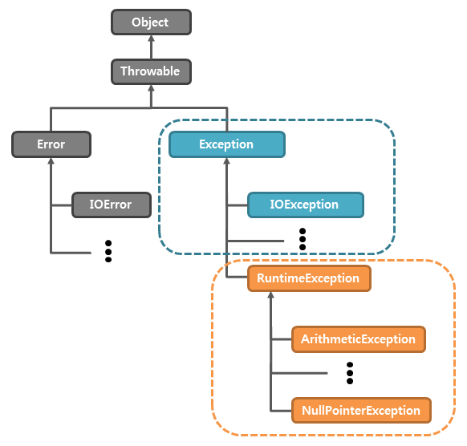

### 오류 vs. 예외 
- 오류(error): 시스템 레벨에서 프로그램에 심각한 문제를 야기하여 실행 중인 프로그램을 종료  
- 예외(exception): 실행 중인 프로그램을 비정상적으로 종료시키지만, 개발자가 발생할 수 있는 상황을 미리 예측하여 처리할 수 있음

<br/>

### 예외 처리(Exception handling)
```java
try { 예외를 처리하길 원하는 실행 코드; }
// 여기서 예외가 발생하면 catch 블록에서 처리, 예외가 발생하지 않는다면 바로 finally 블록으로 이동 

catch (e1) { e1 예외가 발생할 경우에 실행될 코드; } 
catch (e2) { e2 예외가 발생할 경우에 실행될 코드; } 
// 적절한 catch 블록을 찾지 못하면 예외 처리 불가 -> 프로그램 강제 종료 
// 적절한 catch블록을 찾으면 throw 문의 피연산자를 예외 객체의 형식 매개변수로 전달
...
finally { 예외 발생 여부와 상관없이 무조건 실행될 코드; }
```
💡 다른 제어문과는 달리 예외 처리문은 중괄호({})를 생략할 수 없다.

<br/>

### 예외 클래스(Exception class)


<center><span style="color:gray">이미지 출처: tcpschool.com</span></center>

<br/>

1. RuntimeException 클래스
	- 치명적인 예외 상황을 발생시키지 않는 예외들로 구성  
	- try/catch문을 사용하기보다는 예외에 신경쓰며 프로그램 작성하기   
2. 그 외의 Exception 클래스의 자식 클래스
	- 예외를 처리하지 않으면 컴파일 시 오류 발생 
	- 아래의 코드는 readLine()에서 발생할 수 있는 IOException에 대한 예외를 처리해주지 않았으므로 컴파일 시 오류가 발생한다.
	
	```java
	public class Main {
		public static void main(String[] args) {
			BufferedReader br = new BufferedReader(new InputStreamReader(System.in)); 	
			StringTokenizer st = new StringTokenizer(br.readLine()); 
			... 
		}
	}
	```

	- `throws IOException`을 통해 예외를 처리해주거나 `try/catch문`을 통해 예외 처리를 해 주면 된다. 

<br/>

### throw vs. throws vs. try/catch
- throw
	- 강제로 예외를 발생시킨다. 
- throws Exception
	- 메소드를 사용할 때 발생할 수 있는 예외를 미리 명시하기
	&rarr; 사용자가 미리 예외를 인지하고 그에 대한 처리를 강제할 수 있다.

	```java
	public static void main(String[] args) throws IOException { ... do something }
	```
	- do something 부분 실행에 실패하면 caller에게 예외가 전달되고 caller가 예외를 처리한다 &rarr; 즉, 이 메소드를 소환한 코드가 예외를 처리하게 된다. 
- try/catch
```java
	public static void main(String[] args) {

			BufferedReader br = new BufferedReader(new InputStreamReader(System.in));

			try {
				StringTokenizer st = new StringTokenizer(br.readLine());
			} catch (IOException e) {
			// 에러 메세지의 발생 근원지를 찾아서 단계별로 에러를 출력
				e.printStackTrace(); 
			}
		}
```
	- try문 안의 내용 실행에 실패하면 caller에게 예외가 전달되는 것이 아니라 catch 문을 통해 예외를 처리하게 된다. 

<br/>

### 예외 처리의 계층 관계
- 부모 클래스를 상위 catch문에 배치하면 자식 클래스가 속한 catch문이 실행되지 않는다. 
- 따라서 자식 클래스의 예외만을 따로 처리하고 싶으면 자식 클래스 속한 catch 문을 부모 클래스 위에 배치해야 한다.
```java
try { System.out.write(list);} 
catch (Exception e) {e.printStackTrace();} 
catch (IOException e) {e.printStackTrace();}
```
	- 위의 코드에서 IOException은 Exception의 자식 클래스이므로 `catch (IOException e)`문은 영원히 실행되지 않는다. 
	- 그러므로 IOExeption만을 처리하고 싶다면 아래 코드와 같이 `catch (IOException e)`을 위에 써주어야 한다. 
```java
try {
    System.out.write(list);
} catch (IOException e) {  
    e.printStackTrace();
} catch (Exception e) {
    e.printStackTrace();
}
```


#

***Source***

[tcpschool.com/java/java_exception_intro](http://www.tcpschool.com/java/java_exception_intro)
[tcpschool.com/java/java_exception_class](http://www.tcpschool.com/java/java_exception_class)
[tcpschool.com/java/java_exception_throw](http://tcpschool.com/java/java_exception_throw)
[stackoverflow.com/try-catch-versus-throws-exception](https://stackoverflow.com/questions/3241571/try-catch-versus-throws-exception)